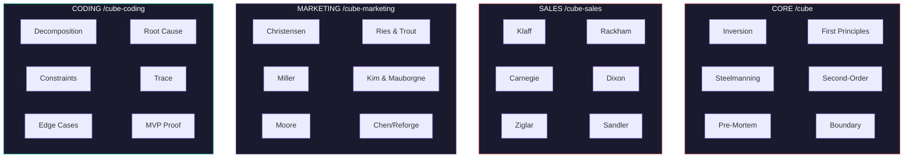
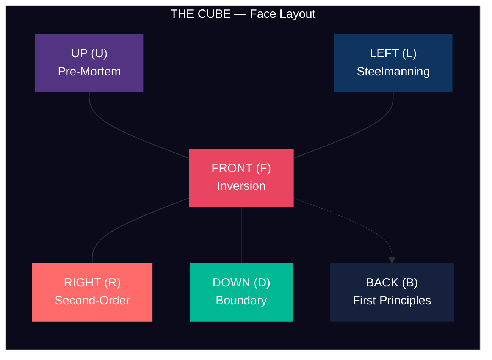
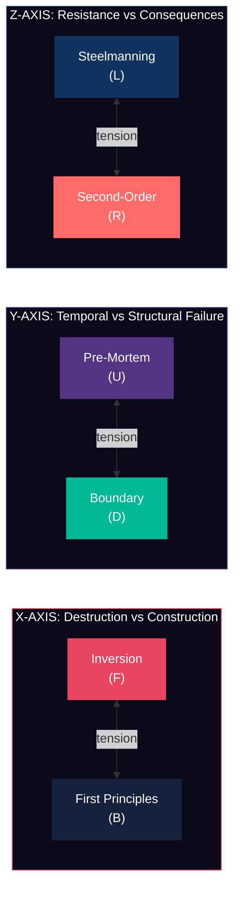
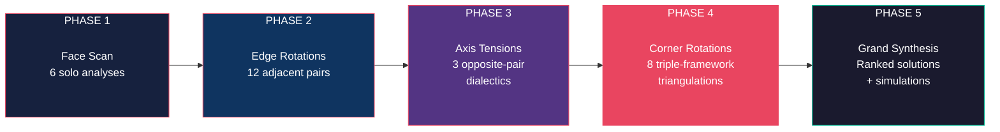
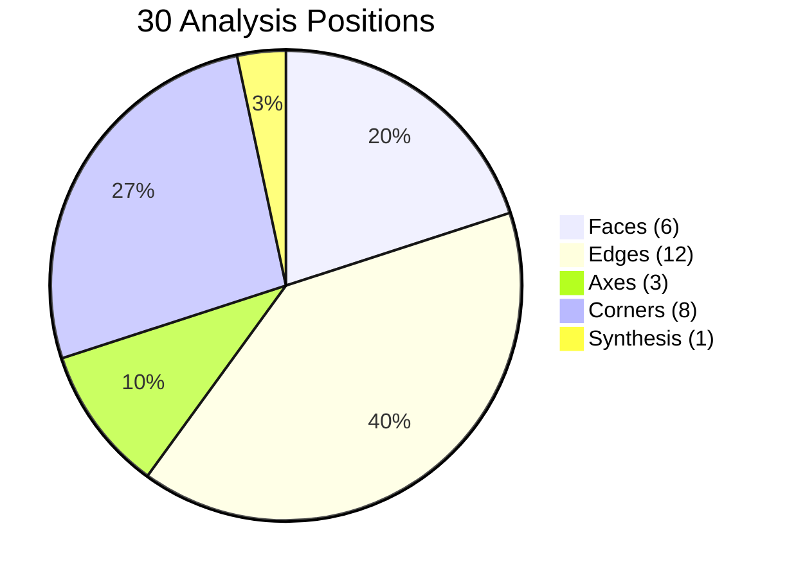

<div align="center">

# The Cube

**See every problem from every angle.**

[](LICENSE)
[]()
[]()
[]()
[]()
[]()
[](https://claude.ai/code)

```
+-------------------------------------------+
|           T H E   C U B E                 |
|     Multi-Dimensional Problem Solver      |
|          v1.0  |  30 Positions            |
+-------------------------------------------+
```

</div>

The Cube is a problem-solving skill for [Claude Code](https://claude.ai/code) that maps six cognitive frameworks to the six faces of a Rubik's cube. Your problem goes at the core. The cube rotates through every geometric combination -- faces, edges, axes, corners -- producing **30 distinct analysis points** before returning to home position with a grand synthesis.

The throughline: every rotation forces you out of the frame the problem arrived in. The problem's native framing is usually part of what's trapping you.

---

## Quick Start

### Install

```bash
git clone https://github.com/mrdulasolutions/TheCube.git
cd TheCube
./install.sh
```

### Use

```
/cube My startup has 6 months of runway left and our main product isn't getting traction
```

That's it. The Cube will crystallize your problem, rotate through all 30 positions, and produce a structured report with ranked solutions and simulation scenarios.

---

## How It Works


---

## Stacks

The Cube ships with **four domain-specific stacks** -- four complete Rubik's cubes, each with six frameworks tailored to a specific discipline. Same rotation protocol, different lenses.



| Stack | Command | Frameworks |
|-------|---------|------------|
| **Core** | `/cube` | Inversion, First Principles, Steelmanning, Second-Order, Pre-Mortem, Boundary |
| **Sales** | `/cube-sales` | Frame Control (Klaff), SPIN (Rackham), Rapport (Carnegie), Challenger (Dixon), Need Satisfaction (Ziglar), Pain Qualification (Sandler) |
| **Marketing** | `/cube-marketing` | Jobs to Be Done (Christensen), Positioning (Ries & Trout), StoryBrand (Miller), Blue Ocean (Kim & Mauborgne), Crossing the Chasm (Moore), Growth Loops (Chen/Reforge) |
| **Coding** | `/cube-coding` | Decomposition, Root Cause Analysis, Constraint Mapping, Trace the Execution, Edge Case Analysis, Minimum Viable Proof |

Run `/cube-stack` to see the full directory with framework descriptions and recommendations.

### Sales Stack

Six elite sales methodologies that create three productive tensions:
- **Control vs Discovery** (Klaff vs Rackham) -- Who leads the conversation?
- **Desire vs Pain** (Ziglar vs Sandler) -- Toward pleasure or away from pain?
- **Warmth vs Hard Truth** (Carnegie vs Challenger) -- Be liked or be respected?

Named rotations include: The Pitch, The Power Play, The Velvet Hammer, The Pain Funnel, The Trusted Advisor, The Charmer, The Surgeon, The Prosecutor, and more.

### Marketing Stack

Six foundational marketing frameworks that create three productive tensions:
- **Truth vs Perception** (JTBD vs Positioning) -- What they need vs what they believe
- **Adoption vs Growth** (Chasm vs Loops) -- What blocks growth vs what compounds it
- **Clarify vs Reinvent** (StoryBrand vs Blue Ocean) -- Perfect the message vs rewrite the game

Named rotations include: The Unmet Job, The Beachhead, The Category Claim, The Flywheel, The Launch Story, The Rocketship, The Category King, and more.

### Coding Stack

Six engineering problem-solving frameworks that create three productive tensions:
- **Breadth vs Depth** (Decomposition vs Root Cause) -- Break it apart vs dig to the bottom
- **Breaks vs Works** (Edge Cases vs MVP Proof) -- What fails vs what succeeds
- **Theory vs Reality** (Constraints vs Trace) -- What should happen vs what does happen

Named rotations include: The Fragmentation Test, The Debugger, The Hidden Wall, The Fault Line, The Architecture Spike, The Bug Hunt, The Surgical Fix, and more.

---

## Slash Commands

| Command | Positions | Best For |
|---------|-----------|----------|
| `/cube [problem]` | 30 | Full analysis (Core stack) |
| `/cube-sales [problem]` | 30 | Sales deal strategy and methodology |
| `/cube-marketing [problem]` | 30 | Marketing strategy and growth |
| `/cube-coding [problem]` | 30 | Debugging, architecture, technical problems |
| `/cube-quick [problem]` | 10 | Fast scan (any stack with `--sales`, `--marketing`, `--coding`) |
| `/cube-face [framework] [problem]` | 1 (deep) | Deep dive into any framework from any stack |
| `/cube-guided [problem]` | 30 | Interactive mode (any stack) |
| `/cube-stack` | -- | List all stacks and frameworks |
| `/cube-feedback` | -- | Rate an analysis to improve the tool |

### `/cube` / `/cube-sales` / `/cube-marketing` / `/cube-coding` -- Full Rotation

The complete 30-position analysis for the chosen stack. Five phases, every geometric combination, full synthesis with solution ranking and simulation scenarios.

### `/cube-quick` -- Quick Scan

A condensed 10-position analysis: all 6 face scans, the 3 axis tensions, and a focused synthesis. Supports all stacks:

```
/cube-quick My startup is running out of runway
/cube-quick --sales This enterprise deal has stalled at procurement
/cube-quick --marketing We are getting traffic but no conversions
/cube-quick --coding The API response times have doubled since the last deploy
```

### `/cube-face` -- Single Framework Deep Dive

Applies ONE framework from any stack with maximum depth. Full 4-phase deep dive protocol:

```
/cube-face inversion Why are we losing customers?
/cube-face klaff My pitch keeps falling flat with VPs
/cube-face jtbd Our users churn after 30 days
/cube-face root-cause The payment service crashes every Monday morning
```

### `/cube-guided` -- Interactive Mode

Same 30 positions as the full rotation, but pauses after each phase. Supports all stacks with `--sales`, `--marketing`, `--coding` flags.

### `/cube-feedback` -- Feedback

Structured feedback collection after an analysis. Saves to `.cube/feedback/` for telemetry.

---

## The Six Faces



| Face | Framework | Core Question |
|------|-----------|---------------|
| **F** | **Inversion** | How would I guarantee this gets worse? |
| **B** | **First Principles** | What's actually true when I strip all assumptions? |
| **L** | **Steelmanning** | What's the strongest case for NOT solving this? |
| **R** | **Second-Order Thinking** | What new problems does my solution create? |
| **U** | **Pre-Mortem** | It already failed. What killed it? |
| **D** | **Boundary Conditions** | What happens at zero? At infinity? At 1000x? |

### Why These Six?

They are **orthogonal** (each sees something the others cannot), **adversarial to framing** (none accept the problem as presented), **universally applicable** (they work on technical, business, personal, and creative problems), and **they compound in combination** (the edges, axes, and corners produce insights no single framework could).

Read [ETHOS.md](ETHOS.md) for the full philosophy.

### Opposite Face Pairs (The Three Axes)

The cube arranges frameworks so opposite faces create productive tension:



| Axis | Faces | Tension |
|------|-------|---------|
| **X** | Inversion vs First Principles | Destruction vs Construction |
| **Y** | Pre-Mortem vs Boundary | Temporal Failure vs Structural Failure |
| **Z** | Steelmanning vs Second-Order | Resistance vs Consequences |

---

## The Rotation Protocol



### Phase 1: Face Scan (Positions 1-6)

Each framework applied independently. Six solo analyses, each ending with a **Key Insight** -- a single-sentence distillation. After all six, a Complexity Assessment rates the problem's depth, risk density, cascade potential, and boundary sensitivity.

### Phase 2: Edge Rotations (Positions 7-18)

Every pair of adjacent frameworks combined. Twelve cross-analyses, each named for its character:

| Position | Name | Combination | What It Reveals |
|----------|------|-------------|-----------------|
| 7 | The Autopsy | Inversion + Pre-Mortem | Overlap between deliberate and actual failure |
| 8 | The Cascade | Inversion + Second-Order | Chain reactions from worst-case scenarios |
| 9 | The Stress Test | Inversion + Boundary | What breaks first under maximum adversity |
| 10 | Devil's Advocate | Inversion + Steelmanning | The case for making it worse on purpose |
| 11 | Foundation Check | First Principles + Pre-Mortem | Which foundational truth is the real failure point |
| 12 | The Projection | First Principles + Second-Order | Downstream effects hidden by assumptions |
| 13 | Bedrock Test | First Principles + Boundary | Which "fundamentals" are actually contextual |
| 14 | The Challenge | First Principles + Steelmanning | First principles that can be defeated |
| 15 | The Fortress | Pre-Mortem + Steelmanning | Where "it's dead" and "don't try" reinforce each other |
| 16 | The Domino Map | Pre-Mortem + Second-Order | Failure modes with the worst cascades |
| 17 | The Pressure Test | Boundary + Steelmanning | Whether the case against solving holds at extremes |
| 18 | The Horizon Scan | Boundary + Second-Order | Effects that only emerge at scale |

### Phase 3: Axis Tensions (Positions 19-21)

Opposite faces create the deepest tensions -- thesis vs antithesis:

| Position | Name | Tension |
|----------|------|---------|
| 19 | The Mirror | Inversion x First Principles |
| 20 | The Crucible | Pre-Mortem x Boundary |
| 21 | The Paradox | Steelmanning x Second-Order |

### Phase 4: Corner Rotations (Positions 22-29)

Three frameworks meet at each corner. Each corner selects exactly one from each opposite pair (one from F/B, one from U/D, one from L/R), ensuring maximum dimensional coverage:

| Position | Name | Frameworks | What Survives |
|----------|------|------------|---------------|
| 22 | The Gauntlet | Inversion + Pre-Mortem + Steelmanning | Triple adversity -- what still matters? |
| 23 | The Avalanche | Inversion + Pre-Mortem + Second-Order | Total failure cascade mapped |
| 24 | The Siege | Inversion + Boundary + Steelmanning | Worth doing even at maximum adversity |
| 25 | The Labyrinth | Inversion + Boundary + Second-Order | Where complexity simplifies under stress |
| 26 | The Tribunal | First Principles + Pre-Mortem + Steelmanning | Judgment day -- who is right? |
| 27 | The Oracle | First Principles + Pre-Mortem + Second-Order | What should have been foreseen |
| 28 | The Anvil | First Principles + Boundary + Steelmanning | What is genuinely unbreakable |
| 29 | The Telescope | First Principles + Boundary + Second-Order | The long view -- what dominates at scale |

### Phase 5: Return to Home (Position 30)

Grand synthesis:

- **Executive Summary** -- 4-line decision-maker brief
- **Pattern Detection** -- recurring themes across rotations
- **Convergence Map** -- where multiple rotations independently agree (highest-confidence findings)
- **Divergence Report** -- unresolved tensions (often where the real decision lives)
- **Blind Spot Report** -- insights visible from only one angle
- **Solution Ranking** -- candidates scored by robustness, survivability, and anti-fragility
- **Simulation Scenarios** -- agent-testable setups for each solution path
- **Final Verdict** -- the clearest path forward

---

## Example Output (Abbreviated)

```
+-------------------------------------------+
|           T H E   C U B E                 |
|     Multi-Dimensional Problem Solver      |
|          v1.0  |  30 Positions            |
+-------------------------------------------+

# THE CUBE -- Analysis Report
## Problem: Startup runway crisis with stalled product traction
### Rotation Date: 2026-04-13
### Total Analysis Points: 30

## THE CORE
**Problem:** We have 6 months of runway remaining and our core product
has plateaued at 200 MAU despite 18 months of development.
**Stakes:** Company survival. Team of 8 loses jobs. Investors lose capital.
**Current Frame:** "We need more features to attract users."
**Domain:** Business/Strategic
**Time Sensitivity:** Immediate

--- PHASE 1: FACE SCAN --- Positions 1-6 --- Progress 0/30

### [F] Position 1: Inversion
To guarantee failure: keep building features nobody asked for, avoid
talking to the 200 users who DID sign up, burn runway on paid acquisition
before finding product-market fit, and refuse to consider a pivot...
**Key Insight:** The fastest way to die is to keep building without
learning why the 200 existing users stayed.

[...28 more positions...]

### EXECUTIVE SUMMARY
**The real problem:** This is not a feature gap -- it is a learning gap.
**The clearest path:** Interview the 200 existing users this week.
**The biggest risk:** Running out of runway while still guessing.
**The key trade-off:** Speed of learning vs. completeness of product.
```

---

## Why a Rubik's Cube?

The geometry is not decorative:



| Element | Count | What It Represents |
|---------|-------|--------------------|
| Faces | 6 | Independent viewpoints |
| Edges | 12 | Natural adjacencies where viewpoints meet |
| Axes | 3 | Fundamental tensions between opposing viewpoints |
| Corners | 8 | Triangulation points where three viewpoints converge |
| Core | 1 | The problem itself, which never moves |

Every element maps to a real geometric relationship. The cube completes all rotations and returns to home position -- every piece is back where it started, but you've seen the problem from every possible combination of angles.

---

## Installation

### Install (Claude Code, Cowork, Desktop)

One command. Works everywhere.

```bash
git clone https://github.com/mrdulasolutions/TheCube.git
cd TheCube
./install.sh
```

This installs all 9 skills to `~/.claude/skills/` in both standalone and directory formats, so `/cube` works in Claude Code, Cowork, and Claude Desktop.

> **Cowork users:** Run this in your Mac's Terminal, then start a new Cowork session. The skills will be available immediately.

Manual alternative:

```bash
mkdir -p ~/.claude/skills
cp .claude/skills/cube*.md ~/.claude/skills/
for f in .claude/skills/cube*.md; do
  name=$(basename "$f" .md)
  mkdir -p ~/.claude/skills/$name
  cp "$f" ~/.claude/skills/$name/SKILL.md
done
```

### Claude.ai Chat (Projects)

No install needed — works through **Projects**:

1. Create a new Project on [claude.ai](https://claude.ai)
2. Upload the skill files from `.claude/skills/` as knowledge (start with `cube.md` and `cube-quick.md`)
3. Paste the contents of [`chat/project-instructions.md`](chat/project-instructions.md) into the project's custom instructions
4. Start a conversation and say: **"Cube this: [your problem]"**

See [`chat/SETUP.md`](chat/SETUP.md) for the full setup guide.

### Command Reference

| Action | Claude Code / Cowork | Claude.ai Chat |
|--------|---------------------|----------------|
| Core full rotation | `/cube [problem]` | "Cube this: [problem]" |
| Sales stack | `/cube-sales [problem]` | "Cube sales: [problem]" |
| Marketing stack | `/cube-marketing [problem]` | "Cube marketing: [problem]" |
| Coding stack | `/cube-coding [problem]` | "Cube coding: [problem]" |
| Quick scan | `/cube-quick [problem]` | "Quick cube: [problem]" |
| Deep dive | `/cube-face inversion [problem]` | "Deep dive inversion on [problem]" |
| Guided mode | `/cube-guided [problem]` | "Guided cube: [problem]" |
| Stack list | `/cube-stack` | "What cubes are there?" |
| Feedback | `/cube-feedback` | "Cube feedback" |

---

## Telemetry and Feedback

The Cube collects no data automatically. All telemetry is opt-in via `/cube-feedback`.

When you run `/cube-feedback` after an analysis, it saves structured feedback to `.cube/feedback/` in your local project. This data never leaves your machine unless you choose to share it.

To contribute your feedback to improve The Cube:
- Open a GitHub issue with the `feedback` label
- Include your feedback file (redact sensitive problem details)
- See [CONTRIBUTING.md](CONTRIBUTING.md) for details

---

## Project Structure

```
TheCube/
├── .claude/skills/
│   ├── cube.md              Core stack (30 positions)
│   ├── cube-sales.md        Sales stack (30 positions)
│   ├── cube-marketing.md    Marketing stack (30 positions)
│   ├── cube-coding.md       Coding stack (30 positions)
│   ├── cube-stack.md        Stack directory
│   ├── cube-quick.md        Quick scan (10 positions, all stacks)
│   ├── cube-face.md         Single framework deep dive (all stacks)
│   ├── cube-guided.md       Interactive mode (all stacks)
│   └── cube-feedback.md     Feedback and telemetry
├── chat/
│   ├── SETUP.md             Claude.ai Projects setup guide
│   └── project-instructions.md  Custom instructions for Claude.ai
├── CLAUDE.md                Project instructions for Claude Code
├── CONTRIBUTING.md          How to contribute
├── ETHOS.md                 Philosophy and design principles
├── LICENSE                  MIT
├── README.md                This file
└── install.sh               One-command global installer (all 9 skills)
```

---

## The Frameworks

### Inversion
Don't ask how to solve it -- ask how to guarantee the problem gets worse. What you're trying to avoid becomes clearer than what you're trying to achieve.

*"All I want to know is where I'm going to die, so I'll never go there." -- Charlie Munger*

### First Principles
Strip every assumption until you hit something you can verify from scratch. Most "problems" are actually inherited constraints that no longer apply.

### Steelmanning
Before you solve a problem, build the strongest possible case for why it can't or shouldn't be solved. If you can't defeat the steel man, you don't understand the problem yet.

### Second-Order Thinking
Every solution creates new problems. Map 2-3 levels deep: "this fixes X, which causes Y, which means Z." Most bad decisions look good at the first-order level.

### Pre-Mortem
Project is already dead. What killed it? Forces specificity -- you stop saying "risk" and start naming actual failure modes. Far more honest than forward-looking planning.

### Boundary Conditions
Push the problem to its extremes: zero resources, unlimited resources, 1000x scale, one day to solve it. Assumptions that feel load-bearing in the normal range often collapse at the edges -- and that tells you what the problem is actually made of.

---

## Philosophy

Read [ETHOS.md](ETHOS.md) for the full philosophy behind The Cube: why these six frameworks, why the cube geometry, what The Cube is and isn't.

## Contributing

Read [CONTRIBUTING.md](CONTRIBUTING.md) for how to submit feedback, propose improvements, suggest new frameworks, or contribute code.

## License

MIT -- see [LICENSE](LICENSE).
